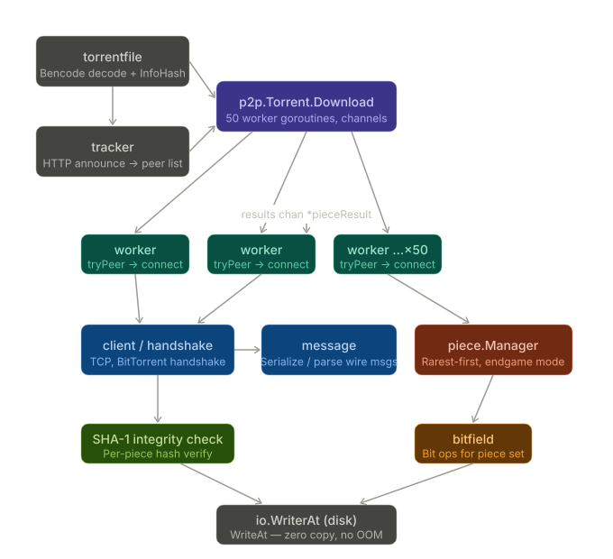

# Gorrent 

A high-performance, concurrent BitTorrent client written from scratch in Go. 

Gorrent was built to deeply understand distributed systems, peer-to-peer networking, and Go's concurrency model. It implements the full BitTorrent protocol, including custom Bencode parsing, HTTP tracker communication, peer handshakes, and a robust piece-sharing engine.

##  Key Technical Highlights

* **High Concurrency:** Architected a worker-pool model using Go channels to support **50+ parallel peer connections** simultaneously, maximizing available network bandwidth.
* **Optimized Throughput:** Implemented a pipelined request strategy with a backlog of **5 concurrent blocks per peer**, effectively eliminating network wait times and saturating the download pipe.
* **Proven Protocol Efficiency:** Benchmarked to achieve a **99.92% data-to-overhead ratio** (only 0.08% protocol overhead) during full-scale OS ISO downloads.
* **Constant Memory Footprint:** Utilized a "disk-first" writing strategy via `io.WriterAt`, allowing the client to download massive files (4GB+) without causing RAM spikes or Out-Of-Memory (OOM) crashes.
* **Guaranteed Data Integrity:** Performs on-the-fly **SHA-1 hashing** for every downloaded piece against the original Torrent metadata, ensuring 100% flawless file reconstruction.
* **Fault Tolerance:** Built-in connection resilience with exponential backoff and retry logic, automatically dropping dead peers after 3 consecutive failures to maintain swarm health.

## Architecture Overview



Gorrent is divided into several focused internal packages:

1. **`torrentfile`**: Parses the `.torrent` file using a custom Bencode decoder, extracts the raw `info` dictionary, and calculates the exact `InfoHash` required for peer discovery.
2. **`tracker`**: Handles HTTP GET requests to the Announce URL, properly encoding the InfoHash and parsing the compact peer list returned by the tracker.
3. **`client` & `handshake`**: Manages the raw TCP connections to peers, performing the initial BitTorrent handshake and establishing the bitfield state.
4. **`message`**: Serializes and deserializes the wire-level BitTorrent protocol messages (Choke, Unchoke, Interested, Have, Request, Piece).
5. **`piece`**: Thread-safe task manager that calculates which pieces are missing and safely hands out `pieceWork` to available idle workers.
6. **`p2p`**: The core concurrency engine. It spawns the 50 worker goroutines, manages the peer queue, pipes downloaded data safely to the disk, and tracks network efficiency metrics.

## Installation & Usage


### Build & Run
Clone the repository and run the engine directly against a `.torrent` file:

```bash
# Clone the repo
git clone [https://github.com/PratikkJadhav/Gorrent.git](https://github.com/PratikkJadhav/Gorrent.git)
cd Gorrent

# Run the client
# Usage: go run main.go <path_to_torrent_file> <output_file_name>
go run main.go backend/torrentfile/testdata/big-buck-bunny.torrent bunny.mp4
